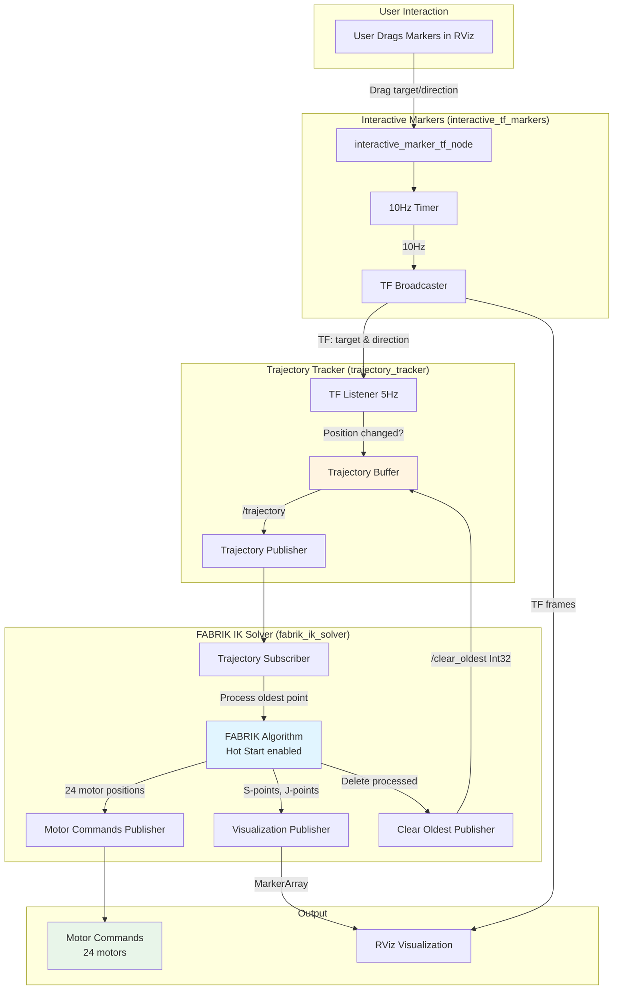

# ROS2 Delta Robot IK System - Architecture

## Overview
Complete system for delta robot inverse kinematics: Interactive markers in RViz generate target positions, trajectory tracker records movements, and FABRIK IK solver computes motor commands for an 8-segment delta robot.

## System Flow



## Packages

### interactive_tf_markers
Interactive markers that broadcast TF transforms continuously.

**Nodes:**
- `interactive_marker_tf_node`: Creates 2 markers, broadcasts TF at 10Hz
- `static_transform_publisher`: Publishes map→world transform

**Launch Files:**
- `interactive_markers.launch.py` - markers only
- `interactive_markers_with_rviz.launch.py` - markers + RViz

### trajectory_tracker
Records TF positions at 5Hz, only when positions change.

**Node:**
- `trajectory_tracker_node`: Samples TF, publishes trajectory data

**Launch Files:**
- `trajectory_tracker.launch.py` - tracker only
- `trajectory_tracker_with_rviz.launch.py` - same (for consistency)

**Messages:**
- `TrajectoryPoint.msg` - timestamp, frame_name, pose
- `Trajectory.msg` - header, points[], total_count

**Topics:**
- `/trajectory` - full trajectory data
- `/trajectory_status` - point count (Int32)
- `/clear_trajectory` - clear all points (Empty)
- `/clear_oldest` - remove N oldest points (Int32)

### fabrik_ik_solver
FABRIK IK solver for 8-segment delta robot. Processes trajectory points sequentially and outputs motor commands. **Uses multithreaded execution for responsive, non-blocking operation.**

**Node:**
- `fabrik_ik_solver_node`: Solves IK for trajectory points, visualizes J/S points

**Launch Files:**
- `fabrik_ik_solver.launch.py` - IK solver with visualization

**Messages:**
- `MotorCommand.msg` - motor positions (24 motors), joint angles, convergence info
- `FabrikVisualization.msg` - S-points, J-points, target, approach point

**Topics:**
- `/motor_commands` - motor positions for robot control
- `/fabrik_visualization` - raw FABRIK data
- `/fabrik_markers` - RViz visualization markers (S/J points)

**Parameters:**
- `num_segments` - number of segments (default: 8)
- `tolerance` - convergence tolerance in meters (default: 0.001)
- `max_iterations` - maximum FABRIK iterations (default: 50)
- `enable_visualization` - toggle J/S point visualization (default: true)
- `use_hot_start` - use previous solution as starting point (default: true)

**Multithreading Implementation (Professional ROS2 Pattern):**
- `MultiThreadedExecutor` with 4 worker threads - enables parallel callback processing
- `ReentrantCallbackGroup` - allows trajectory callbacks to run concurrently
- Thread-safe locking (`threading.Lock`) - prevents race conditions on processing flag
- Try-finally blocks - ensures cleanup even on errors
- **Result**: IK solving doesn't block marker dragging or TF broadcasting

**Key Files:**
- `fabrik/` - FABRIK algorithm implementation (in package)
- `/robot_constants.py` - delta robot physical parameters (workspace root)

**Visualization:**
- S-points: Blue spheres (30mm) + blue chain line
- J-points: Green spheres (30mm) + green chain line

## Markers

| Name | Color | Size | Initial Position | TF Frame |
|------|-------|------|------------------|----------|
| **target** | Yellow | 60mm | 150, 0, 600mm | `target` |
| **direction** | Cyan | 40mm | 0, 0, 600mm | `direction` |

## TF Tree

```
map (static)
 └─ world
     ├─ target (dynamic, 10Hz)
     └─ direction (dynamic, 10Hz)
```

## Key Implementation Details

**TF Broadcasting:**
- 10Hz timer continuously broadcasts current marker poses
- Feedback callback only stores poses (no broadcasting)
- Prevents conflicts and ensures smooth marker movement

**Trajectory Tracking:**
- 5Hz sampling checks TF positions
- Only records when position changes (>1e-6 tolerance)
- Points deleted by FABRIK IK solver after processing

**FABRIK IK Solving:**
- Processes trajectory points sequentially (oldest first)
- **Hot Start Optimization**: Uses previous robot configuration (S/J points) as starting point
  - Stored in FABRIK solver instance (`self.last_s_points`, `self.last_j_points`)
  - Persists across solve calls - reduces iterations from 50 → 5-7
  - First solve: Cold start (default configuration)
  - Subsequent solves: Hot start (last known position)
- **Approach Point Handling**: Direction marker controls end-effector orientation
  - Tracks last approach point to detect changes
  - When approach changes: Adds 0.1mm offset to target to force iteration
  - Ensures approach constraint is applied even when target unchanged
- Deletes processed points automatically via `/clear_oldest`
- Visualizes S-points (blue spheres + blue chain), J-points (green spheres + green chain) in RViz
- Outputs 24 motor positions (3 motors × 8 segments)

## RViz Configuration

**Package-level configs** (for individual testing):
- `interactive_tf_markers/rviz/interactive_markers.rviz` - markers only
- Individual packages launch with their own minimal configs

**Workspace-level config** (for complete system):
- `/home/yuuki/ROS2/rviz/main.rviz` - combines all visualizations
- Used by main.launch.py for the complete system

This separation keeps package configs minimal and focused, while the main config includes all system visualizations (markers, FABRIK J/S points, trajectory, etc.).

## Launch

```bash
# Launch everything (main entry point)
cd ~/ROS2
source install/setup.bash
ros2 launch main.launch.py

# Individual packages (with their own RViz configs for testing)
ros2 launch interactive_tf_markers interactive_markers_with_rviz.launch.py
ros2 launch trajectory_tracker trajectory_tracker.launch.py
ros2 launch fabrik_ik_solver fabrik_ik_solver.launch.py
```

## Build

```bash
cd ~/ROS2
colcon build
source install/setup.bash
```

## Usage Example

```python
# Access TF positions in your own node
self.tf_buffer = Buffer()
self.tf_listener = TransformListener(self.tf_buffer, self)

transform = self.tf_buffer.lookup_transform(
    'world', 'target', rclpy.time.Time()
)
```

```bash
# Monitor trajectory
ros2 topic echo /trajectory_status
ros2 topic echo /trajectory

# Clear trajectory
ros2 topic pub /clear_trajectory std_msgs/Empty "{}"
ros2 topic pub /clear_oldest std_msgs/Int32 "data: 10"

# Monitor motor commands
ros2 topic echo /motor_commands
ros2 topic echo /fabrik_visualization
```
